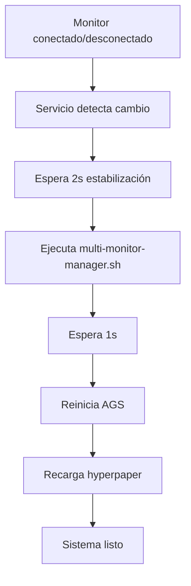

# Resumen de Implementación - Recarga Automática de Monitor Hotplug

## 🎯 Objetivo

Implementar detección automática de monitores externos que reinicie AGS y recargue hyperpaper al conectar/desconectar monitores, eliminando la necesidad de intervención manual.

## ✅ Cambios Realizados

### 1. Script Principal: `monitor-hotplug.sh`

**Ubicación:** `~/.config/hypr/scripts/monitor-hotplug.sh`

**Funcionalidad agregada:**
```bash
# Nueva función reload_hyperpaper()
- Detecta y ejecuta el script de recarga de hyperpaper
- Registra todas las acciones en el log
- Manejo robusto de errores si el script no existe

# Flujo actualizado en monitor_changes()
1. Detectar cambio de monitor
2. Esperar 2s para estabilización
3. Ejecutar multi-monitor-manager.sh auto
4. Esperar 1s
5. Reiniciar AGS
6. Recargar hyperpaper

# Nuevos comandos disponibles:
- reload-hyperpaper: Recarga solo hyperpaper
- reload-all: Reinicia AGS y recarga hyperpaper
```

### 2. Keybinds Actualizados

**Archivo:** `~/.config/hypr/configs/keybinds.conf`

**Nuevo keybind agregado:**
```bash
# Línea 64
bind = $mainMod SHIFT, B, exec, $scriptsDir/monitor-hotplug.sh reload-all
```

**Resumen de keybinds relacionados:**
- `Super + B` → Reiniciar solo AGS (existente)
- `Super + Shift + B` → Reiniciar AGS y recargar hyperpaper (NUEVO)
- `Super + W` → Abrir selector de wallpapers (existente)

### 3. Documentación

**Archivos creados:**

#### `MONITOR-HOTPLUG-README.md`
- Guía completa del usuario
- Descripción del problema y solución
- Uso manual del script
- Troubleshooting
- Logs y diagnósticos

#### `MONITOR-HOTPLUG-IMPLEMENTATION.md` (este archivo)
- Resumen técnico de la implementación
- Detalles de cambios realizados
- Pruebas y verificación

### 4. Changelog

**Archivo:** `CHANGELOG.md`

Entrada agregada en sección `[Unreleased]` > `### Added`:
- Descripción completa de la funcionalidad
- Problema resuelto
- Archivos relacionados
- Referencia a documentación

## 🔄 Flujo de Ejecución



## 🧪 Pruebas Recomendadas

### Prueba 1: Detección Automática
```bash
# 1. Verificar que el servicio esté corriendo
systemctl --user status hyprland-monitor-hotplug.service

# 2. Monitorear logs en tiempo real
tail -f /tmp/hyprland-monitor-hotplug.log

# 3. Conectar/desconectar monitor externo
# 4. Verificar en logs que se ejecuten las recargas
```

### Prueba 2: Recarga Manual
```bash
# Probar recarga completa
~/.config/hypr/scripts/monitor-hotplug.sh reload-all

# O usar el keybind
# Presionar: Super + Shift + B
```

### Prueba 3: Verificación de Estado
```bash
# Ver estado actual de monitores
~/.config/hypr/scripts/monitor-hotplug.sh check

# Ver logs del servicio systemd
journalctl --user -u hyprland-monitor-hotplug.service -n 50
```

## 📋 Checklist de Verificación

- [x] Script `monitor-hotplug.sh` actualizado
- [x] Función `reload_hyperpaper()` implementada
- [x] Flujo de recarga integrado en `monitor_changes()`
- [x] Nuevos comandos `reload-hyperpaper` y `reload-all` agregados
- [x] Keybind `Super + Shift + B` configurado
- [x] Documentación completa en `MONITOR-HOTPLUG-README.md`
- [x] Changelog actualizado
- [x] Servicio systemd verificado

## 🔍 Validación de Archivos

```bash
# Verificar permisos de ejecución
ls -lh ~/.config/hypr/scripts/monitor-hotplug.sh
ls -lh ~/.config/hypr/hyprpaper/reload.sh

# Ambos deben tener permisos de ejecución (x)
# Si no: chmod +x [archivo]
```

## 📊 Logs y Diagnóstico

### Log Principal
```bash
tail -f /tmp/hyprland-monitor-hotplug.log
```

**Buscar entradas como:**
```
[2025-10-29 XX:XX:XX] Monitor configuration changed:
[2025-10-29 XX:XX:XX]   Previous: eDP-1
[2025-10-29 XX:XX:XX]   Current:  eDP-1,HDMI-A-1
[2025-10-29 XX:XX:XX] Running multi-monitor auto-configuration
[2025-10-29 XX:XX:XX] Restarting AGS due to monitor configuration change
[2025-10-29 XX:XX:XX] AGS restarted successfully
[2025-10-29 XX:XX:XX] Reloading hyperpaper due to monitor configuration change
[2025-10-29 XX:XX:XX] Hyperpaper reload initiated
```

### Log de Systemd
```bash
journalctl --user -u hyprland-monitor-hotplug.service -f
```

## 🚀 Próximos Pasos

### Para el Usuario

1. **Probar la funcionalidad:**
   - Conectar y desconectar el monitor externo
   - Observar que AGS y wallpapers se recarguen automáticamente

2. **Si hay problemas:**
   - Revisar logs en `/tmp/hyprland-monitor-hotplug.log`
   - Usar `Super + Shift + B` para recarga manual
   - Consultar troubleshooting en `MONITOR-HOTPLUG-README.md`

3. **Opcional - Reiniciar servicio:**
   ```bash
   systemctl --user restart hyprland-monitor-hotplug.service
   ```

### Mejoras Futuras Potenciales

- [ ] Agregar notificaciones visuales cuando se detecten cambios
- [ ] Implementar cooldown configurable entre recargas
- [ ] Agregar perfiles de wallpaper por configuración de monitores
- [ ] Crear widget de AGS para control manual

## 📝 Notas Técnicas

### ¿Por qué este orden de ejecución?

1. **Multi-monitor-manager primero:** Configura correctamente los monitores en Hyprland
2. **Espera de 1s:** Permite que Hyprland aplique la configuración
3. **AGS después:** Se inicia con la configuración de monitores correcta
4. **Hyperpaper al final:** Aplica wallpapers a los monitores ya configurados

### ¿Por qué 2 segundos de espera inicial?

Los monitores externos pueden tardar en estabilizar la señal al conectarse. Los 2 segundos iniciales evitan múltiples detecciones durante la conexión.

### ¿Por qué bash en segundo plano para hyperpaper?

El script de reload de hyperpaper puede tomar varios segundos. Ejecutarlo en segundo plano (`&`) permite que el monitor continúe funcionando sin bloqueos.

## 🎓 Referencias

- Documentación de usuario: `MONITOR-HOTPLUG-README.md`
- Changelog: `CHANGELOG.md`
- Multi-monitor general: `README-MultiMonitor.md`
- Script principal: `scripts/monitor-hotplug.sh`
- Servicio systemd: `.config/systemd/user/hyprland-monitor-hotplug.service`
